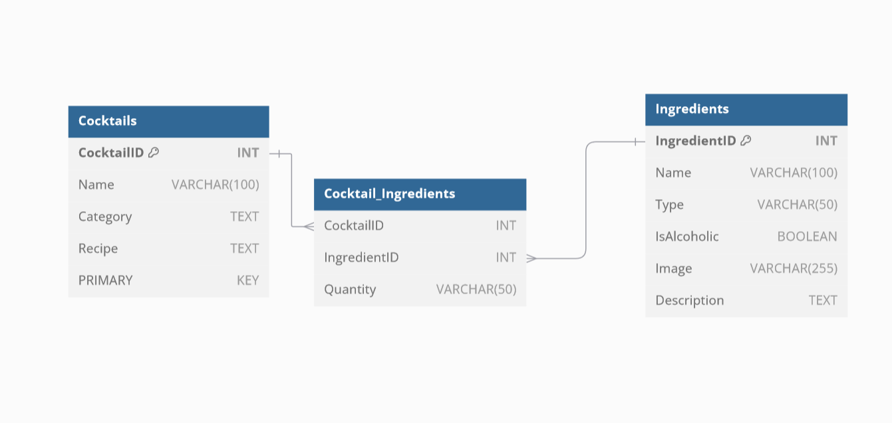

# Cocktails API

## Installation
1. Clone the repository
2. Type `npm install` for the dependencies
3. You will need a mariadb database. You can use the example database in . Here is its project

4. to start use `npm run start`
5. for docs, use the `/api-docs` endpoint
    